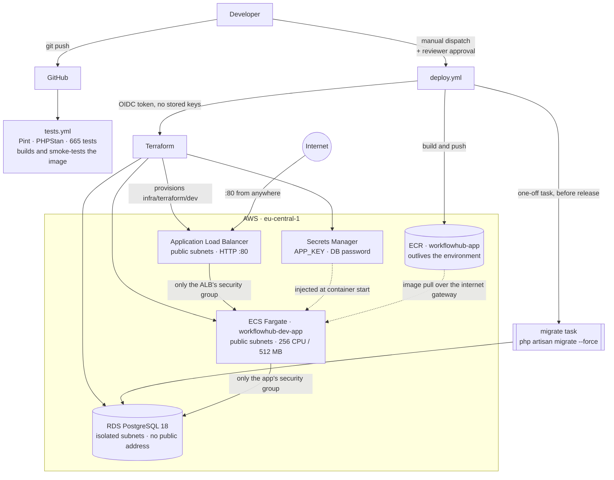

# WorkFlowHub

A multi-tenant project and team management application for small companies and agencies.

A user can belong to several organizations at once, holding a different role in each.
Every organization owns its own projects, tasks, and members, and no organization's data
is reachable from another. Authorization is enforced server-side by policies on every
action, never by hiding controls in the interface.

## Features

Built and working:

- **Organizations** — create an organization, rename it, delete it, and switch between the
  ones you belong to
- **Membership and roles** — Owner, Manager, and Employee, scoped per organization rather
  than globally, so the same user can be an Owner in one and an Employee in another
- **Invitations** — invite by email with a signed, expiring token; resend or revoke a
  pending invitation. Accepting requires a verified email matching the invited address
- **Projects** — per-organization projects with a status lifecycle and archiving
- **Tasks** — status, priority, due date, and assignment to a member of the organization,
  with lateness derived from the due date rather than stored
- **Dashboard** — role-aware: managers see what needs attention across the organization,
  employees see the work assigned to them

Not built. The domain model reserves room for these, and nothing in the application claims
otherwise: clients, time tracking, a client portal, and subscription billing.

## Stack

| | |
|---|---|
| PHP | 8.5 |
| Laravel | 13 |
| Livewire | 4 (single-file page components) |
| Flux UI | 2 (free tier) |
| Tailwind CSS | 4 |
| PostgreSQL | 18 |
| Testing | Pest 5 |
| Static analysis | Larastan / PHPStan |
| Formatting | Laravel Pint |

## Local development

Requires PHP 8.5, Composer, Node 22+, and Docker.

PostgreSQL and Mailpit run in containers; the application itself runs on the host.

```bash
# 1. Configuration. Compose reads DB_* from this file, so it must exist first.
cp .env.example .env

# 2. PostgreSQL on port 5433 and Mailpit on 1025/8025.
docker compose up -d

# 3. Install dependencies, generate the app key, migrate, and build assets.
composer setup

# 4. Serve the application, queue listener, and Vite together.
composer dev
```

The application is then at `http://localhost:8000`. Mail is captured by Mailpit rather
than delivered — read it at `http://localhost:8025`.

`DB_PORT` defaults to 5433 rather than 5432 so the container cannot collide with a
PostgreSQL instance already running locally. Change it in `.env` if that port is taken.

`AUTH_AUTO_VERIFY_NEW_USERS=true` in `.env.example` marks newly registered users as
verified so you can reach the dashboard without opening Mailpit. It is a local
convenience only and must be `false` in production.

### Tests and checks

```bash
php artisan test --compact          # 665 tests
composer ci:check                   # Pint, PHPStan, and the full suite
vendor/bin/pint --dirty             # format changed files
```

`composer ci:check` is what CI runs. The test suite uses a separate `workflowhub_testing`
database, created by `docker/postgres/init` when the data volume is first initialized.

## Production container

`docker/app/Dockerfile` builds a self-contained image running PHP-FPM and Nginx under
supervisord, as an unprivileged user. Composer and Node run in earlier build stages, so
neither they nor the development dependencies reach the runtime image.

```bash
docker build -f docker/app/Dockerfile -t workflowhub-app .

docker run --rm -p 8080:8080 \
  -e APP_ENV=production \
  -e APP_KEY="$(php artisan key:generate --show)" \
  -e APP_DEBUG=false \
  -e APP_URL=http://localhost:8080 \
  -e DB_CONNECTION=pgsql -e DB_HOST=... -e DB_PORT=5432 \
  -e DB_DATABASE=... -e DB_USERNAME=... -e DB_PASSWORD=... \
  workflowhub-app
```

The container refuses to start without `APP_KEY`, or with `APP_DEBUG=true` while
`APP_ENV=production`. It does not run migrations; schema changes belong in a separate
one-off job rather than in whichever container starts first.

`.env.example` marks every key whose value must differ in production. Reasoning for the
image and its configuration is in
[ADR-007](docs/decisions/ADR-007-production-containerization.md).

## Infrastructure and deployment

The application runs on AWS, in `eu-central-1`, described entirely in Terraform under
`infra/terraform/`. Nothing is clicked in the console — the environment is created and
destroyed from GitHub Actions.



Three security groups form a chain. The load balancer accepts traffic from anywhere; the
application accepts its port *only* from the load balancer's group; the database accepts
5432 *only* from the application's group. Membership is by group reference rather than by
CIDR, so the rules stay correct however addresses change and there is no IP range to keep
up to date.

The database has no public address and sits in subnets with no route to the internet. It
is reachable only from inside the VPC, and only from the application tier — two
independent reasons, so neither one alone is load-bearing.

The load balancer's group admits 443 as well as 80, but only an HTTP listener on 80
exists; see the note on HTTPS below.

### Design decisions

**No NAT Gateway.** Tasks run in public subnets with public IP addresses so they can reach
ECR and the AWS APIs directly. A NAT Gateway would cost more per month than everything
else here combined, and the isolation that matters — nothing reaching the database — is
enforced by security groups rather than by subnet placement.
See [ADR-008](docs/decisions/ADR-008-network-topology.md).

**Liveness and readiness are different questions.** `/up` answers whether the process is
alive; `/up/ready` runs a real query and returns 503 when the database is unreachable. The
load balancer's target group checks `/up/ready`, so a task that cannot serve is taken out
of rotation instead of being sent traffic it would answer with a 500. The readiness route
is registered outside the `web` middleware group, so polling it does not create a
database-backed session every fifteen seconds.

**Migrations run as a one-off task, before the new version is released.** They never run
from whichever container happens to start first. Schema changes are additive and
backward-compatible, so the old and new versions can both be running during a rollout.
See [ADR-010](docs/decisions/ADR-010-expand-contract-migrations.md), which also records
the readiness endpoint above.

**OIDC instead of stored AWS keys.** GitHub exchanges a signed token for short-lived
credentials; no long-lived access key exists to leak. The trust policy accepts exactly two
subject strings, both naming this repository and the `aws-dev` environment. Because it
trusts the *environment* form of the claim rather than the branch form, a workflow that
skips the approval gate cannot authenticate at all — the approval is load-bearing rather
than advisory. The role's permissions are four scoped policies, not `AdministratorAccess`.

**Remote state in S3, split three ways.** `bootstrap/` creates the state bucket,
`shared/` holds what outlives any environment (the registry, the OIDC provider, the CI
role), and `dev/` holds the environment itself. Destroying `dev/` therefore cannot take
the registry or the deployment role with it. Locking uses S3 conditional writes, so no
DynamoDB table is needed.
See [ADR-009](docs/decisions/ADR-009-terraform-state-boundaries.md).

### Cost-conscious by design

The environment is provisioned on demand and destroyed after use rather than left running.
RDS and the load balancer bill by the hour whether or not anyone visits, and a portfolio
project has no traffic to justify that. `app_desired_count` defaults to `0`, so Terraform
builds the infrastructure without starting the application; the deployment scales it up
and `destroy.yml` tears it back down.

What survives a teardown costs nothing to keep: the state bucket, the ECR repository, the
OIDC provider, and the IAM role. `destroy.yml` finishes by asking AWS directly whether any
database, snapshot, load balancer, target group, cluster, VPC, secret, volume, or Elastic
IP remains, and fails if it cannot prove the account is empty.

This is also why there is no HTTPS listener and no domain name. The load balancer serves
HTTP on port 80; a certificate needs a domain, and a domain that points at an environment
which exists for twenty minutes at a time is not worth the cost.

### Seeing it running

Both workflows are `workflow_dispatch` only — nothing deploys on push — and both are
gated behind a GitHub Environment with a required reviewer, so a run pauses until a person
releases it.

1. **Actions → deploy → Run workflow**
2. Approve the `aws-dev` gate when the run pauses
3. Wait roughly six to seven minutes
4. The run summary prints the load balancer's URL
5. **Actions → destroy → Run workflow**, approve again

This needs write access to the repository, so it is something to be walked through rather
than something a visitor can trigger. The deployment ends by requesting `/up`, `/up/ready`,
`/`, and `/login` through the load balancer and failing the run unless all four return 200.

Every part of this has been run end to end, not just written: infrastructure provisioned
from CI, image built and pushed, migrations applied to a fresh database, the service
scaled up, the load balancer reporting the task healthy, all four endpoints answering over
the public internet, then the whole environment destroyed and the account verified empty.

The full reasoning for each decision is in [docs/decisions/](docs/decisions/).

## Documentation

- [Architecture overview](docs/architecture/overview.md)
- [Domain model](docs/domain/domain-model.md)
- [Product requirements](docs/product/requirements.md) and [MVP scope](docs/product/mvp.md)
- [Architecture decision records](docs/decisions/) — one per slice, recording what was
  decided and why
